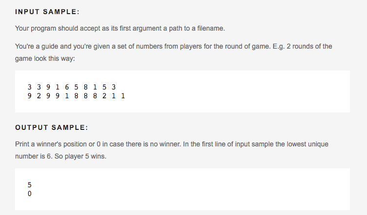

# CodeEval

Once you're finished, jump onto [CodeEval](http://codeeval.com) and work through some problems in Ruby.  Find the problems that look like they're just beyond your comfort zone.

## Instructions

The test cases in CodeEval can be a little strange.  Don't worry about the "path to a filename" code they want you to write.

Instead: For each problem you do, make a new ruby file yourself and add the test cases for the problem.

Here's an [example file](./sample-code-eval-file.rb) you can reference.  In the example file, notice how we represent the sample input from CodeEval by `puts`ing whether it `==` the expected output.  For example:

turns into

Do the same with your challenges.

Create new files like the [example file](./code-eval-instructions.md) as you pick challenges to do.  Translate the sample inputs and outputs like we did above.

Feel free to work through the example file first.

