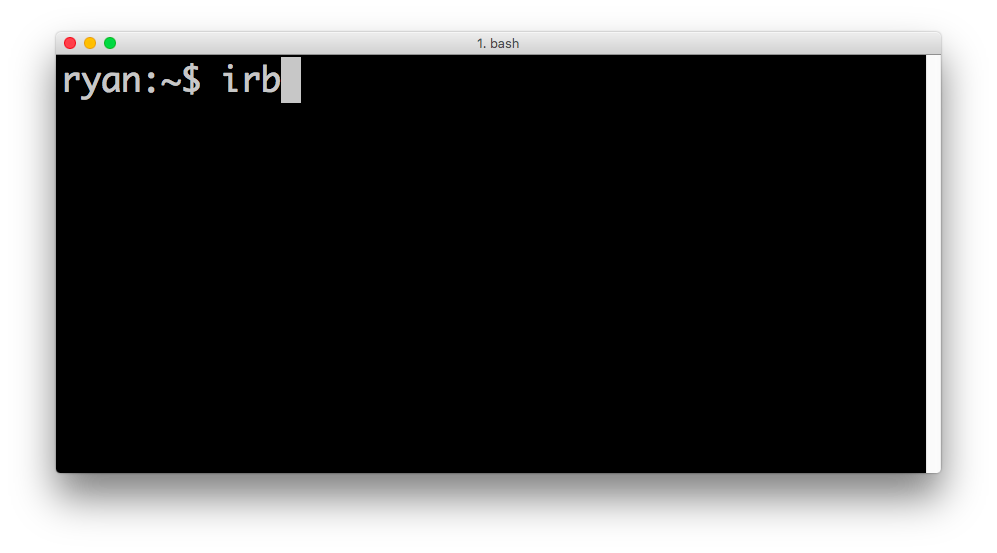
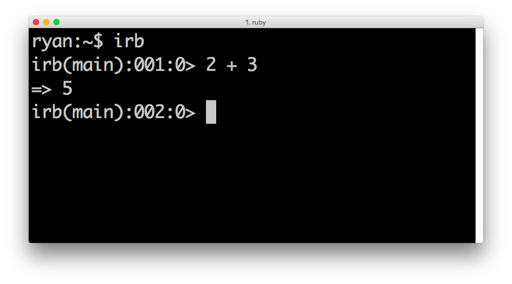
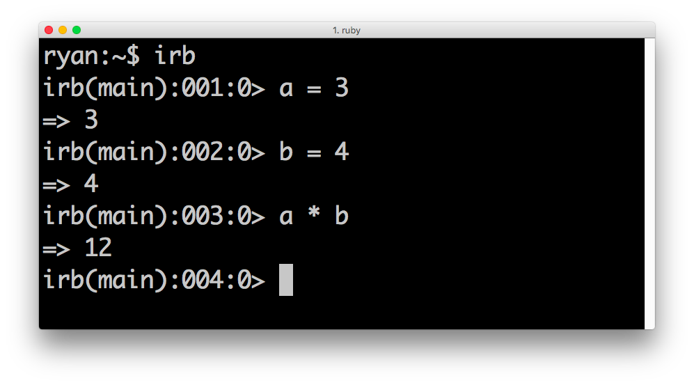
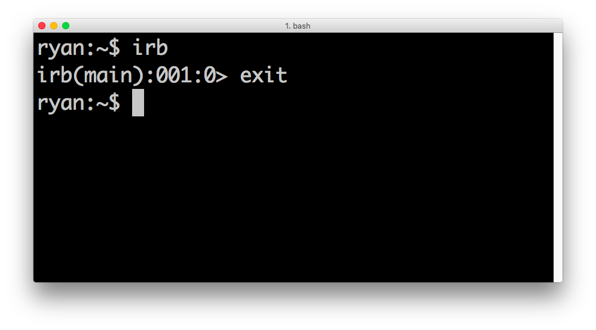
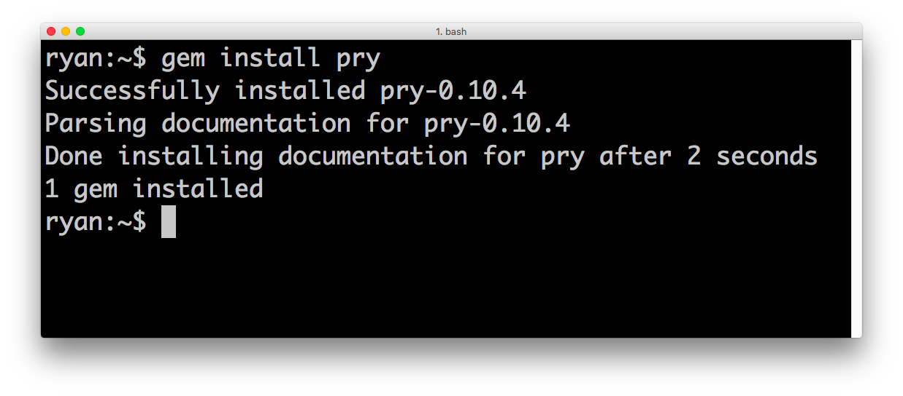
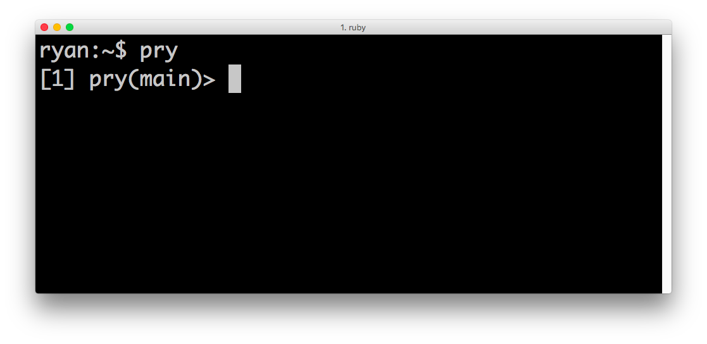
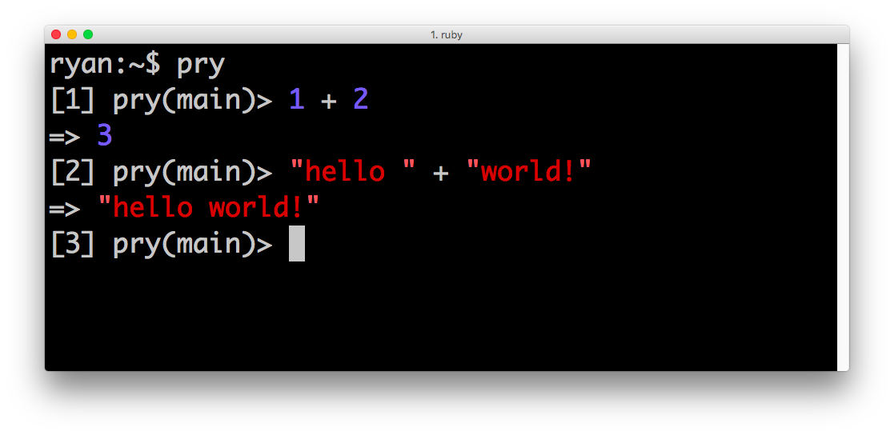

## REPLs

## Introduction

The Interactive Ruby Shell, more commonly known as IRB, is one of the most important tools for a new developer. IRB allows you to quickly test small bits of code without having to create new scripts. IRB is a type of *repl*.

To get it up and running, all you need to do is type the following into a terminal prompt:

`irb`

This launches IRB. Inside, you can perform basic ruby methods, like adding two numbers:

You can also create variables:

You can leave irb by typing `exit`

## Pry

Pry is a slightly nicer repl; it's color-coded and formats output nicely for us. Install pry by running:

`gem install pry`

Start pry by just typing:

`pry`

(You leave in the same manner, `exit`)

Oh the colors! :)

