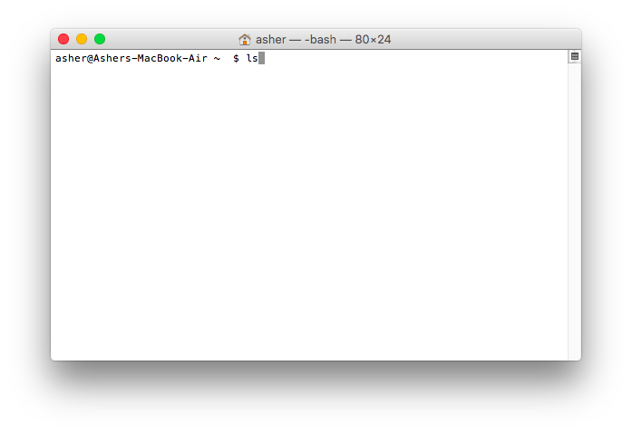

# Using the Terminal

## Introduction

The terminal is the most direct line of communication between you and your computer. You will often need to execute commands from the terminal, such as `ls`.



This guide will walk you through some of the most useful terminal commands and give you some tricks to speed up your terminal use.

Open a terminal now. In cloud9, your terminal should already show up on the bottom of your screen.

## General Notes

- To execute a terminal command type it into the terminal and press enter
- Terminal commands are case sensitive: `ruby` is not the same thing as `Ruby`

## Commonly Used Commands

Here are some of the terminal commands you will use on a daily basis. **Write these down**

 Command | Definition              | Use this command to...
 ------- |:------------------------|------------------------------
 `pwd`   | print working directory | show you your current location
 `ls`    | list                    | show you what files/folders exist in your current location
 `cd`    | change directory        | move into and out of folders
 `mkdir` | make directory          | create a folder
 `clear` | (or command-K)          | clear the terminal output
 `ruby`  | ruby interpreter        | run a ruby file
 `irb`   | interactive ruby shell  | test small pieces of ruby code

---
### pwd

Many commands function in the context of the working directory. The `pwd` command prints out the path of the directory you are currently in. The `pwd` command is great for keeping track of where you are.


---
### ls

The `ls` command prints a list of the contents of a directory. By default it will list the contents of the working directory.


---
### cd

The `cd` command changes your working directory. It is your primary tool for navigating the computer's directory structure. We can use `cd` in the following ways:

 Command          | What it does
 ---------------- |:------------------------
 `cd some_folder` | Go into 'some_folder'
 `cd ..`          | Go up one folder
 `cd ../..`       | Go up two folders
 `cd ~`           | Go to the home directory
 `cd`             | Go to the home directory
 `cd /`           | Go to the root directory


---
### mkdir

The `mkdir` command creates a new directory (also known as a folder) at a provided path. For example `mkdir my_new_directory` creates a new directory called `my_new_directory` in the working directory. `mkdir my_new_directory/another_new_directory` creates a new directory called `another_new_directory` in `my_new_directory` which itself is in the working directory.

By default `mkdir` can only make a new directory inside of an existing directory. If you tried to enter `mkdir funky/pics` and `funky` doesn't already exist it would not work. To get around this we can use the `-p` option. `mkdir -p funky/pics` would create both `funky` and `pics`.


---
### clear

`clear` simply clears all the text from the terminal.


---
### ruby

The `ruby` command allows us to run our ruby files. Say you have a program saved in a file called `terminal_fun.rb`. In order to run it you would enter the command `ruby terminal_fun.rb`. This will execute your code and print the results to the terminal.


If your code has any errors they will also be printed to the terminal.


---
## Additional Resources

### explainshell.com

Some terminal commands can be really complex. One resource that might be able to help you parse all this info is [explainshell](http://www.explainshell.com). This neat little website will break down a complicated terminal command into its various parts and give you a brief explanation of each bit.

### Man Pages

As we saw with `mkdir`, some terminal commands can take options that change how they function. If you want to see a list of a command's options as well as detailed instructions about its use you can look at the command's 'man page'. You can access a command's 'man page' by entering `man some_command` into the terminal. For example, to see the 'man page' for `ls` you would type `man ls`.


You can scroll around a 'man page' using the arrow keys and page up/down. To exit out of a 'man page' press `q`.

---
## Tips and Tricks
### ctrl-C

If we run this ruby program:

```ruby
def loop_forever
    while true
        puts "LOOPING FOREVER"
    end
end

```

It will loop forever! Hit ctrl-C to make it stop. Do this whenever your program runs longer than it should.

### Tab Completion

One of the biggest time saving features of the terminal is 'tab-completion'. If you start typing something in the terminal and press 'tab' your computer will try to fill in the rest of the word with matching commands, programs, and files. This is like a much simpler version of OSX's 'spotlight'. If you press tab a second time, your terminal should display a list of all possible matches. Using 'tab-completion' can dramatically speed up your terminal use.

### Command History

Another neat trick is using the terminal's command history function. While in the terminal you can press the 'up' and 'down' arrow keys to cycle through previously entered commands.

Try it out!
