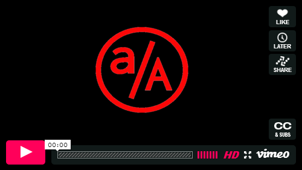

# Variables and Scope

## Introduction

We've already used variables a number of times so far, but let's talk about them in greater detail!

## Variable

Similar to variables in algebra, we can create variables that will provide a name to various objects that we can access later. As an example:

```ruby
x = 5
```

This code stores the number 5 into a variable called `x`. Later on, we can use this variable name to retrieve the value:

```ruby
x = 5
puts x
```

In ruby, the equal sign, `=`, is known as the **assignment operator**.  Ruby evaluates everything to the right of the `=` sign, and stores the result into the variable on the left-hand side.

### What can a variable store?

**Any object** in Ruby can be stored in a variable. This means that we can use variables to store any objects we may encounter. Some we're already familiar with:

```ruby
  a = 5
  b = "string"
```

And some objects we'll learn about later, but we can still store them in variables!

```ruby
  arr = [1, 2, 3]
  t = true
  n = nil
```

### Variable Re-assignment

You can also re-assign a variable so that it refers to a different value:

```ruby
# Assignment
my_favorite_author = "Franz Kafka"
puts my_favorite_author

# Re-assignment
my_favorite_author = "Aldous Huxley"
puts my_favorite_author
```

This means that the value assigned to a variable can change over time. Let's look at another example:

```ruby
a = 5
b = a
c = b

a = 7

puts a # ==> 7
puts b # ==> 5
puts c # ==> 5
```

Run this example in the pry and confirm the output!

Let's watch an example of how Re-assignment works.

[](https://vimeo.com/181828680)

## Variable Naming

Variable names in ruby can be made with any combination of:
  * lowercase letters: a - z
  * uppercase letters: A - Z
  * numbers: 0 - 9
  * underscores: _

The following are valid variable names:
  * `x`
  * `x3`
  * `a88HDK83H`
  * `_`
  * `___5`

### Rules

A ruby variable name must follow the following rules:
  * Cannot start with a number (ex: `3x`)
  * No special characters (@ # $ % ^ & | , ' " ...)
  * Cannot be one of ruby's keywords (below)

### Rubyisms

Ruby developers follow a particular set of guidelines called Rubyisms. (We'll talk more about these later). For now, know that you should adhere to the following guidelines when naming variables:

  * all lower case letters
  * use **snake case**

#### Snake Case

Snake Case is the tactic of separating words with underscores. Some variables that might use snake case include:

```ruby
  my_favorite_number = 5
  your_favorite_number = 8
```

### Keywords

The following collection of words are called **keywords** or **reserved words**. We can't use them as variable names. Here is a list of all the **keywords**:

```ruby
__FILE__  and    def       end     in      or      self   unless
__LINE__  begin  defined?  ensure  module  redo    super  until
BEGIN     break  do        false   next    rescue  then   when
END       case   else      for     nil     retry   true   while
alias     class  elsif     if      not     return  undef  yield
```
