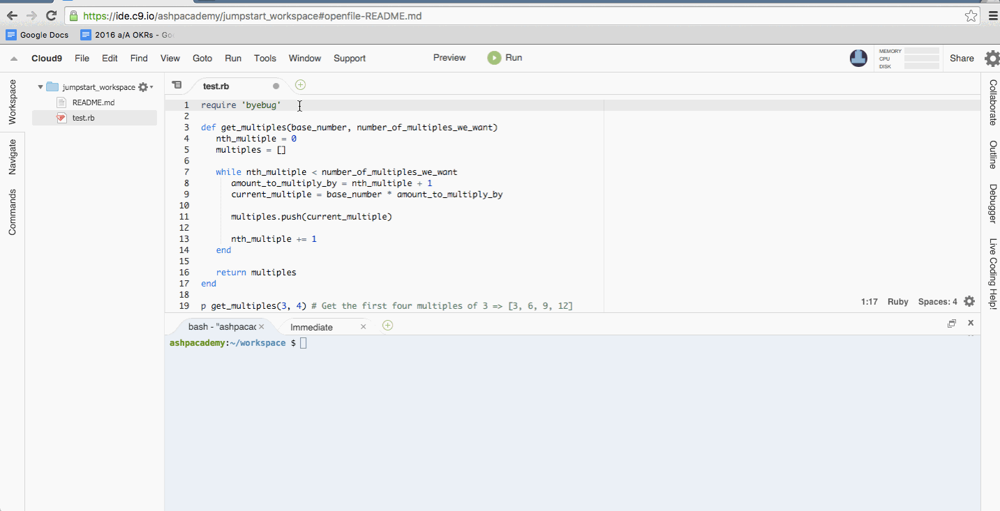

# Debugging

You might notice that it can be hard to catch the errors you make.  These errors, like misspellings, or being off by one, might feel "silly" or "stupid", but professional software engineers make the same mistakes.  The key is catching them quickly.

The most effective way to catch your errors is to use the debugger.  You had a small taste of this in the pre-curriculum.

The way to put a debugger in your code: stick `byebug` in the middle of a function and run your code.  Make sure you `require 'byebug'` at the top of your file.  For example:

In your interviews, we'll be asking you to play the role of debugger (knowing what every variable is at every point in time in a function), so it's important that you know how to use a debugger well.  Debuggers are arguably the most useful tool you can have while learning to program.

For your final assessment, it will be very helpful to know how to use the debugger to fix your errors quickly.

The three most important commands in `byebug`:

- `n` (or `next`): Goes to the next line
- `c` (or `continue`): Goes to the next place byebug lives in the code
- Printing out variable names: `elephants`, `grandma_age`, etc.  You type out the variable name and press enter.

Take a look at how you can use byebug while you're running your code.

You can find out more about byebug in the "Byebug Commands" section [here][byebug]. Feel free to play around with new commands.

[byebug]: https://github.com/deivid-rodriguez/byebug
