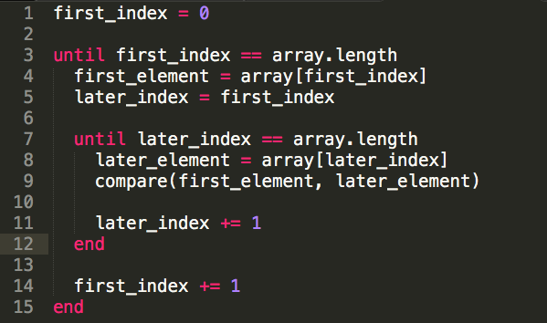

# Nested Iteration

Here's an example of nested iteration in code:



There's one "until" nested inside of another "until".

```ruby
# This function takes an integer number of minutes and an integer number of
# seconds as input and proceeds to count down, printing the remaining number
# of minutes and seconds in the form m:ss, until the time reaches 0:00.
# Here's sample output for the egg_timer(2, 1):
#
# 2:01
# 2:00
# 1:59
# ...
# 0:01
# 0:00
# Time's up!
def egg_timer(minutes, seconds)

  while minutes >= 0

    while seconds >= 0
      puts "#{minutes}:#{'%02d' % seconds}"
      # sleep 1                               # pauses the function for 1 second.

      seconds -= 1
    end

    seconds = 59
    minutes -= 1
  end

  puts "Time's up!"
end
```

There's one `while` nested inside of another `while`.

```ruby
def color_mixer(colors)
  mixes = []

  colors.each do |first_color|
    colors.each do |second_color|
      mixes << "#{first_color}-#{second_color}" unless first_color == second_color
    end
  end

  mixes
end
color_mixer(["red", "blue", "green"]) # => [ "red-blue", "red-green",
#      "blue-red", "blue-green",
#      "green-red", "green-blue"]
```
There's one `each` nested inside of another `each`.

```ruby
adjectives = ["bawdy", "puny", "rank", "saucy", "yeasty", "surly"]
hyphenated = ["beetle-headed", "elf-skinned", "onion-eyed", "swag-bellied"]
nouns = ["lout", "scut", "strumpet", "foot-licker", "bugbear"]

# This function prints every possible insult using three
# arrays of words as input. Using the three arrays above,
# we can generate Shakespearean insults:
# insult_generator(adjectives, hyphenated, nouns)
# You bawdy, beetle-headed, lout!
# You bawdy, beetle-headed, scut!
# You bawdy, beetle-headed, strumpet!
# ...
# You surly, swag-bellied, foot-licker!
# You surly, swag-bellied, bugbear!
#
def insult_generator(first_adjectives, second_adjectives, nouns)
  first_adjectives.each do |first_word|
    second_adjectives.each do |second_word|
      nouns.each do |third_word|
        puts "You #{first_word}, #{second_word}, #{third_word}!"
      end
    end
  end
end

insult_generator(adjectives, hyphenated, nouns)
```
