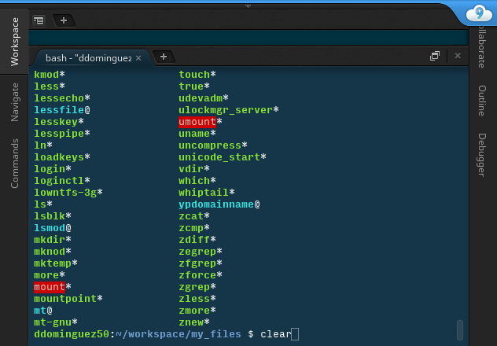
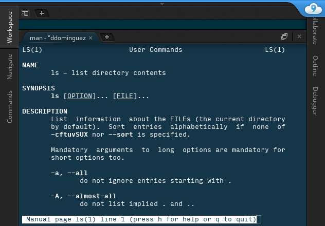

# Using the Terminal

## Introduction

You will often need to execute commands from the terminal.  `ls` is an example terminal command:


This guide will walk you through some of the common terminal commands that you will find yourself using, as well as some tips and tricks to speed up your terminal use.

Open a terminal now. In cloud9, your terminal should already show up on the bottom of your screen.

## General Notes

- To execute a terminal command type it into the terminal and press enter
- Terminal commands are case sensitive. `ruby` is not the same thing as `Ruby`

## Paths in the Terminal

- Get a feel first
    - Type `cd ~` to get to your home directory.
    - Type `pwd`
    - Type `ls`.  Then try `ls .` (should be the same thing).
    - Type `ls ..` to see the directory right above.
    - Type `cd .`, then `ls`.
    - Type `cd ..`, then `ls`.
    - Type `pwd`.

There are a few special symbols that you can use in your path to specify certain locations. The `.` represents your working directory. For example `./some_file.rb` refers to a file called `some_file.rb` that is located in the working directory.


The `..` symbol allows you to refer to the directory that contains the working directory. For example `../../some_file.rb` refers to the file `some_file.rb` that is located two directories up from the working directory.

## Commonly Used Commands

Here are some of the terminal commands you will use on a daily basis.

- `pwd` print working directory
- `ls` list
- `cd` change directory
- `mkdir` make directory
- `clear` (or command-K)
- `ruby`


### pwd
#### Print Working Directory

The `pwd` command prints out the path of the directory you are currently in. As mentioned above, many commands function in the context of the working directory. The `pwd` command is great for keeping track of where you are in your computer's directory structure.


### ls
#### List Directory Contents

The `ls` command prints a list of the contents of a directory. By default it will list the contents of the working directory. If you use the `ls` command with a path to another directory it will print out that directory's contents.


By default the `ls` command will not show the 'hidden' files in a directory. Hidden files are files whose names start with a `.` like `.inputrc` or `.bash_profile`. These hidden files are usually things like configuration and settings files that you will not need to change very often. In order to show these files with `ls` we can use the `ls -a` option.


### cd
#### Change Working Directory

The `cd` command allows us to change our working directory. If we enter `cd` without any arguments it will take us back to our `home` directory. If we give it a path it will take us to the location specified by that path.


The `cd` command is our main means of navigating around our computer's directory structure when using the terminal.

### mkdir
#### Make a New Directory

The `mkdir` command creates a new directory at a provided path. For example `mkdir my_new_directory` creates a new directory called `my_new_directory` in the working directory. `mkdir my_new_directory/another_new_directory` creates a new directory called `another_new_directory` in `my_new_directory` which itself is in the working directory.

By default `mkdir` can only make a new directory inside of an existing directory. If you tried to enter `mkdir funky/pics` and `funky` doesn't already exist it would not work. To get around this we can use the `-p` option. `mkdir -p funky/pics` would create both `funky` and `pics`.


### clear
#### Clear the Terminal

My favorite terminal command is `clear`. It simply clears all the text from the terminal.




### ruby
#### Run a Ruby Program

As software developers we need a way to run our code. The `ruby` command does just that. Say you have a program saved in a file called `terminal_fun.rb`. In order to run it you would enter the command `ruby terminal_fun.rb`. This will execute your code and print the results to the terminal.


If your code has any errors they will also be printed to the terminal.


## Getting Help
### Google

As with most things, a good place to find out info about terminal commands is [google](http://google.com/). If you think that you should be able to do something using the terminal but don't know how then google it! For example: if you want to figure out how to display the contents of a file in the terminal, search for something like "display file contents in terminal" or "unzip file in terminal".

### explainshell.com

Some terminal commands can be really complex. One resource that might be able to help you parse all this info is [explainshell](http://www.explainshell.com). This neat little website will break down a complicated terminal command into its various parts and give you a brief explanation of each bit.

### Man Pages

As we saw with `mkdir` and `ls`, some terminal commands can take options that change how they function. If you want to see a list of a command's options as well as detailed instructions about its use you can look at the command's 'man page'. A 'man page' is built in instructions for a terminal command or program. You can access a command's 'man page' by entering `man command>` into the terminal. For example, to see the 'man page' for `ls` you would type `man ls`.



You can scroll around a 'man page' using the arrow keys and page up/down. To exit out of a 'man page' press `q`.

## Tips and Tricks
### ctrl-c

Try running this ruby program:

```ruby
def loop_forever
    while true
        puts "LOOPING FOREVER"
    end
end

```

It's going to go forever.  Hit Ctrl-C to make it stop.  Do this whenever your program runs longer than it should.

### Tab Completion

One of the biggest time saving features of the terminal is 'tab-completion'. If you start typing something in the terminal and press 'tab' your computer will try to fill in the rest of the word with matching commands, programs, and files. This is like a much simpler version of OSX's 'spotlight'. If you press tab a second time, your terminal should display a list of all possible matches. Using 'tab-completion' can dramatically speed up your terminal use.

### Command History

Another neat trick is using the terminal's command history function. While in the terminal you can press the 'up' and 'down' arrow keys to cycle through previously entered commands.

Try it out now.

This is very useful if you find yourself typing the same command over and over again. Instead of typing long commands like `bundle exec rspec spec/` or `gcc -Wall -o myProg main.c && valgrind --leak-check=full ./myProg` over and over (you don't have to know these commands), you can just press 'up' and 'enter'.
